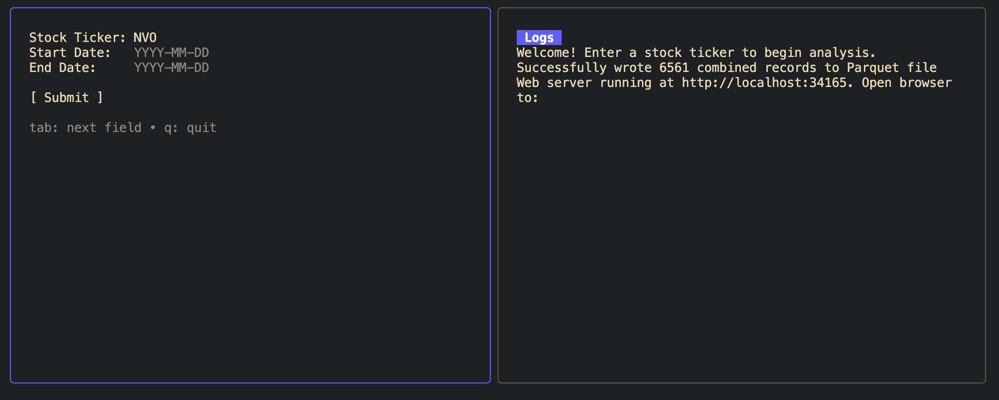
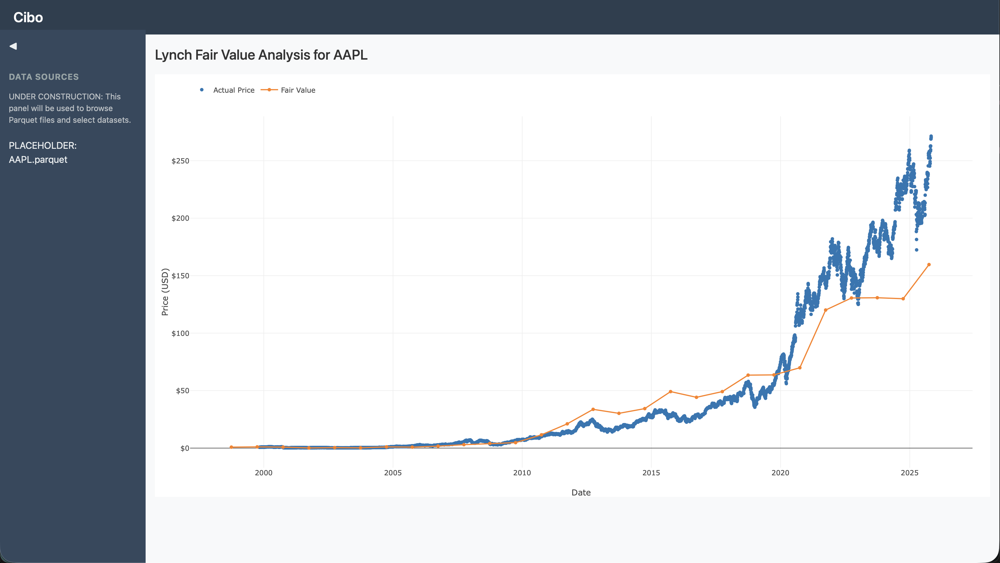

# CIBO

A stock price analysis assistant for performing common price/value analysis pipelines in a minimal application. This entire project was inspired by one screenshot in a Reddit thread

which seemed like an occasionally useful visualization to have. Added onto this was the desire to have things like dividend payments and upcoming earnings call data all accessible via one system.

Remember: all models are wrong, but some are useful.

## Terminal UI based data pipeline

Built on GO and Bubbletea TUI library, CIBO is a terminal first application for analyzing stock data and producing data sets (currently stored in parquet) for larger analysis needs in other applications like Libre Calc or Sheets.

Currently implemented features:

- Lynch Fair Value analysis pipeline (price to earnings ratio based)

Future pipelines

- Price to Sales fair value analysis
- Dividend dates (past and future)
- Upcoming earnings call calendar event generator
- Schiller PE overlay

## Sample data

Examples of produced data sets can be found in the directory `/sample_data/`.

## Needed for local building and development

- Git
- VS Code
- VS Code "Containers Tools" [extension](https://marketplace.visualstudio.com/items?itemName=ms-azuretools.vscode-containers)
- Docker Desktop
- A [free Alpha Vantage API key](https://www.alphavantage.co/support/#api-key) to get real data (free is limited at 25 calls a day)

After cloning the application, open the file directory in VS Code (`code .` in the code directory), then click the prompt to reopen in a devcontainer. If you don't get the UI prompt you can find the command via the Command Palette. Once the container builds, all needed software should be installed that is required to run it and work on the app including debugging, unit testing, compilation to bins, etc.

## If you want to explore raw data from the parquet files

You'll need the following extensions installed in VS Code, installed in the devcontainer (not needed to for compilation or execution of the application).

- Data Wrangler
- Python extension (Data Wrangler dependency)
- Jupyter extension (Data Wrangler dependency)

These SHOULD all auto install and configure based on the setup in the `.devcontainer/Dockerfile` and `.devcontainer/devcontainer.json` files. See `common_commands.md` for more info on them.
