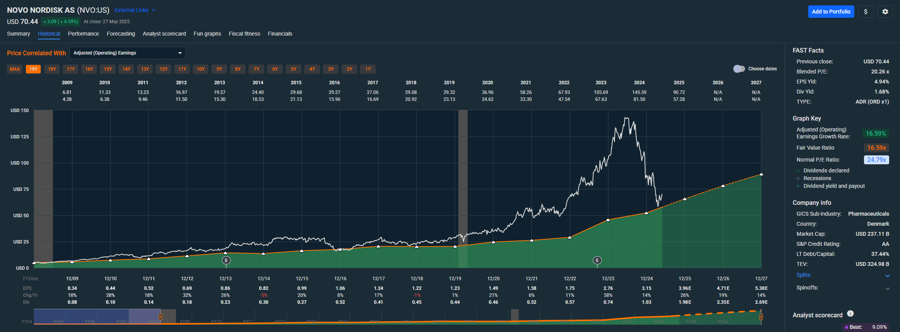
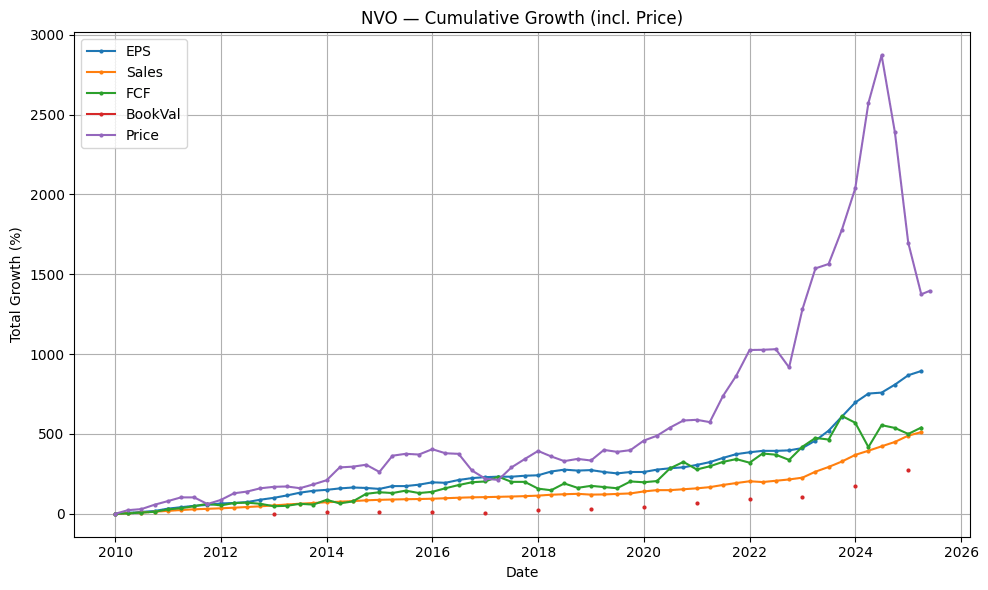
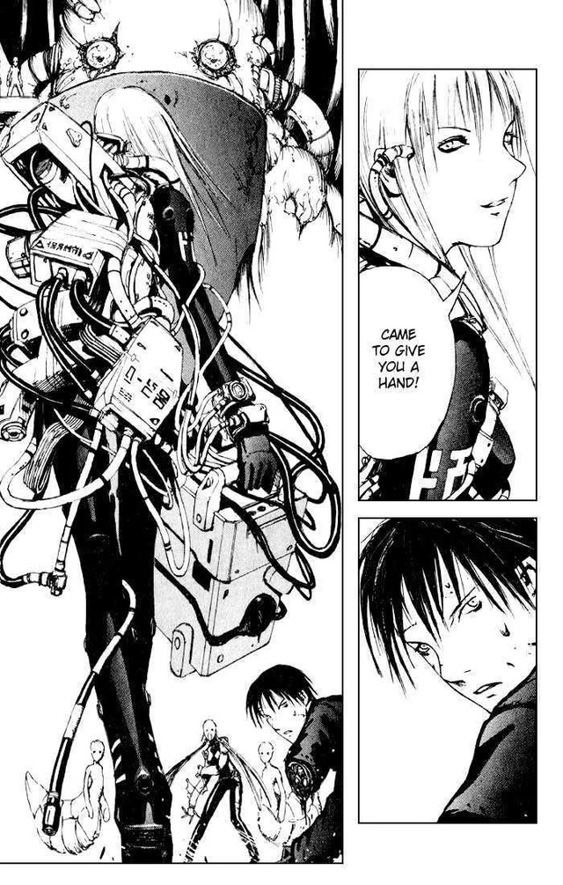

# Initial inspiration and a vision of a workflow

## Context

The original vision for this project was inspired by a Reddit post of all things.

In a discussion about Novo Nordisk stock price taking a dive and the drivers behind why that happened a user submitted the above screenshot without much detail as to where they got it. It shows a comparative charting of price relative to a set historical P/E Ratio for Novo, and in this situation shows very clearly how aggressively the price had deviated from the norm without the underlying income of Novo pulling the ratio back down and justifying the price. Things got a little over hyped.

Here was another similar plot with some other lines in there too.

Well I want a tool like that too.

## Workflow vision

Here's what I have in mind as of this writing.

1. User see's a stock and is curious just how over hyped it might be relative to previous historical happenings. "Past performance isn't a guarantee of future performance and all that" but it's a good start when thinking about it.

2. User enters ticker and a P/E ratio to compare against (getting a reasonable historical P/E could be a different job on the system but for now the user will just guess one) and the analysis works as a "job" of sorts. Pull daily candle data going back for the whole history of the stock (with UI controls to narrow this view), and that returns a historical chart like the above.

3. This data is all saved into a flat file format that the UI will load. I currently see no need for a relational database with long term persistence so I'm not going to build that. An advantage here will be the results are all stored in flat files that can be exported easily to other systems. Want more data? Run a new job. Job view might need to be a feature in the UI too.

## Present and future thoughts

For now this is only going to pull past data via an API endpoint. Daily granularity. I don't care about micro price movements (meaning things like minute level swings). Pull the whole set at once and cache it somewhere locally to limit API calls since this is going to be on a free non commercial API initially with some limitations.

Future earnings estimates data is going to be a different project for later, but per the screenshot seeing what the optimistic bean counters at a company are forecasting can be useful for contextualizing current trends.

There are quite a few ways to define PE ratio. Pick a standard to be consistent. Consult "Little book of valuation" equations.

## Tech choices

Code readability, testability, stability, doc quality, and general developer experience is the top priority.

The author has an aversion to closed source licensing, bad documentation, and most importantly bad developer tooling. So C# and Java are non starters.

Rust is probably overkill and a little too steep of an initial learning curve given the lack of performance concerns on this project. I'm not building embedded software, a kernel, or an SDK here. If I build some sort of wildly compute and memory intensive data processing algorithm that I want to optimize the hell out of, Rust might make an appearance as a discrete module.

Python would probably be the practical choice if I was building this with a team, especially given recent performance and typing improvements in Python.

Javascript / Node would be also be a practical choice especially with Typescript and that will be used for the UI. I like the async / promise syntax of JS less than the equivalent in Go and find the JS versions less readable but that's personal opinion.

Go comes with async network call support, multiprocessing support, and good unit testing support all out of the box in the standard library. The official docs are fantastic. I have books on my shelf on Go and I used it previously at a job. It's got a sweet mascot.

## Why "Cibo"?

I like naming projects after thematically appropriate fictional characters. If I call this thing "Golang React Stock Plotter" first of all thats lame. Second of all if one day I switch tech to use Rust, convert it to a pure CLI application that uses ASCII, and plot Furby prices with it, the name will age pretty bad. Cibo will always be a cool name.
