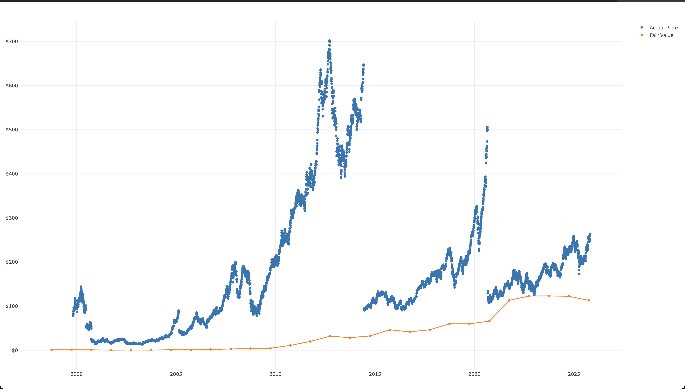

# Handling stock splits

Alpha Vantage are jerks and of course the API endpoint with split adjusted historical prices is locked behind a paywall. As a result I will be solving this issue myself.

After adjusting the daily price data to be a scatter plot ("markers" as Plotly calls them) I got this very nifty looking chart from my data pipeline.

This was good news as it confirmed my whole Lynch Fair Value pipeline produced a "fair value" price that wasn't totally out of whack, at least based on a curve shape / rough fit assessment. Bad news is that those daily price values instantly revealed what I suspected from looking at the data earlier, that my data endpoint is returning raw prices that aren't adjust for splits. Fortunately for me the endpoints for "corporate action - split" is free, so I'll be developing my own algorithm to adjust all previous price values by their split history, _then_ calculate the Lynch curve.

The added advantage of doing it myself is that Im not relying on an adjusted endpoint. If Alpha Vantage had been generous and provided an adjusted endpoint for free, then if I ever changed APIs I'd be without a method to handle raw data. Winning the long game here. It _should_ be pretty easy.

Something like:

> "get raw data" -> "get split data (number of, dates, split ratio)" -> "adjust all daily prices (that'll use some memory)" -> "feed _that_ data into the fair value pipeline" -> write to parquet.

The bad thing here is that that's 3 calls out of my 25 a day for one stock pipeline. I may want to consider a mechanism by which a user can store data in parquet form if they want to run this pipeline a lot and save calls in the future. Stock splits dont happen a lot, so once those dates and values are stored it shouldn't need much updating. Same with historical quarterly earnings honestly. I still don't want to deal with a real database here, but I'm drifting towards that....
